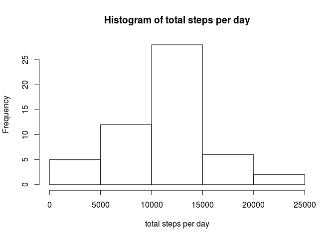
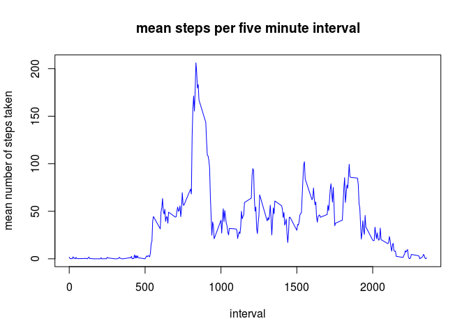
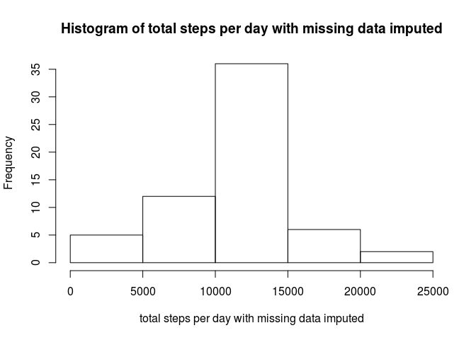
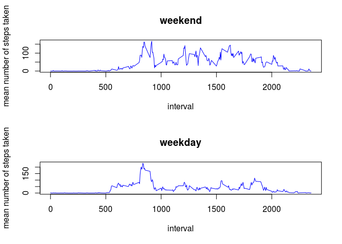

# Reproducible Research: Peer Assessment 1

```r
# PA1-mmccorm.Rmd
# 051516 last modified 051516
# This is course assignment one for coursera reproducible research course
# in the JHU data science series
```

## Loading and preprocessing the data

```r
par(mfrow=c(1,1))
rm(list = ls())
setwd("~/RepData_PeerAssessment1")
unzactivity=unz('activity.zip','activity.csv')   
activitydata=read.csv(unzactivity)
```

## What is mean total number of steps taken per day?

```r
library(plyr)
summarybyday<-ddply(activitydata,~date,summarise,mean=mean(steps),total=sum(steps))
hist(summarybyday$total, xlab="total steps per day", main="Histogram of total steps per day")
```

<!-- -->

```r
totmean<-mean(summarybyday$total, na.rm=TRUE)
totmedian<-median(summarybyday$total, na.rm=TRUE)
```
The mean total number of steps taken per day is 1.0766189\times 10^{4}.
The median total number of steps taken per day is 10765.

## What is the average daily activity pattern?

```r
summarybyinterval<-ddply(activitydata,~interval,summarise,mean=mean(steps, na.rm=TRUE))
plot(summarybyinterval, type="l", ylab="mean number of steps taken", main="mean steps per five minute interval",col="blue")
```

<!-- -->

```r
maxrow<-summarybyinterval[which.max(summarybyinterval$mean),]
maxinterval<-maxrow$interval
maxmeanbyinterval<-maxrow$mean
```
The interval with the most steps on average is 835.
The average number of steps in this interval is 206.1698113.

## Imputing missing values

```r
totnas<-sum(is.na(activitydata$steps))
impute <- function(x, fun) {
  missing <- is.na(x)
  replace(x, missing, fun(x[!missing]))
} 
imputedactivitydata <- ddply(activitydata, ~ interval, transform, steps = impute(steps,(mean)))
imputedactivitydata$steps<-round(imputedactivitydata$steps)
imputedsummarybyday<-ddply(imputedactivitydata,~date,summarise,mean=mean(steps),total=sum(steps))
hist(imputedsummarybyday$total, xlab="total steps per day with missing data imputed", main="Histogram of total steps per day with missing data imputed")
```

<!-- -->

```r
imputedtotmean<-mean(imputedsummarybyday$total)
imputedtotmedian<-median(imputedsummarybyday$total)
```
There are 2304 total missing values in this dataset.
After imputing missing data as the mean of the corresponding interval, rounded to an integer, the mean total steps per day is 1.0765639\times 10^{4}.
After imputing missing data as the mean of the corresponding interval, rounded to an integer, the median total steps per day is 1.0762\times 10^{4}.

## Are there differences in activity patterns between weekdays and weekends?

```r
imputedactivitydata$date <- as.Date(imputedactivitydata$date)
notweekend <- c('Monday', 'Tuesday', 'Wednesday', 'Thursday', 'Friday')
imputedactivitydata$weekday <- factor((weekdays(imputedactivitydata$date) %in% notweekend), levels=c(FALSE, TRUE), labels=c('weekend', 'weekday'))

weekendactivitydata<-subset(imputedactivitydata, weekday == "weekend")
weekdayactivitydata<-subset(imputedactivitydata, weekday == "weekday")

weekendsummarybyinterval<-ddply(weekendactivitydata,~interval,summarise,mean=mean(steps))
weekdaysummarybyinterval<-ddply(weekdayactivitydata,~interval,summarise,mean=mean(steps))

par(mfrow=c(2,1))

plot(weekendsummarybyinterval, type="l", ylab="mean number of steps taken", main="weekend",col="blue")
plot(weekdaysummarybyinterval, type="l", ylab="mean number of steps taken", main="weekday",col="blue")
```

<!-- -->


